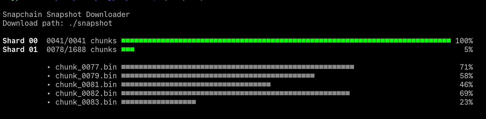

# SnapDown (Snapchain Snapshot Downloader)

`snapdown` lets you download a [Snapchain](https://github.com/farcaster_xyz/snapchain) snapshot
before starting a new snapchain node.



`snapdown` gives you more flexibility than the embedded downloader:

- You can stop/start and it will pick up where you left.
- When restarting, local chunk sizes will be compared to remote, and if they do not match they will be re-downloaded
- Concurrent chunk downloads: I have found that sometimes a chunk may download at very low speeds, having concurrent downloads removes the bottleneck and results in faster overall download.
- Downloaded chunks are not automatically deleted.

## 1. Install

Download, and unzip [the binary that corresponds to your platform](https://github.com/vrypan/snapdown/releases)

Move it to a directoryt in your `$PATH`.

If you want to build from source, clone the repo an run `make`

Check it has been installed in your PATH:

```
snapdown version
```

To see all options
```
snapdown --help

snapchain snapshot downloader

Usage:
  snapdown [command]

Available Commands:
  completion  Generate the autocompletion script for the specified shell
  download    Download the current snapshot
  extract     Extract downloaded snapshot
  help        Help about any command
  version     Get the current version

Flags:
  -h, --help   help for snapdown

Use "snapdown [command] --help" for more information about a command.
```

## 2. Download the snapshot

Use
```
snapdown download ./snapshot
```

to download the snapshot arhive to `./snapshot`.

Or `snapdown download --help` for more options.


## 3. Extract the snapshot

The snapshot must be extracted to the `.rocks` directory relative to where you will run your docker container.

Use something like (adjust paths, if your setup is different)

```
snapdown extract ./snapshot .rocks
```

You can also extract only one shard if you want. Check the options with
```
snapdown extract --help
```


### Alternative method: Extract manually

You can manually extract the archive, using `tar` if you prefer.

You can test the data integrity using the following command (check with shards 0, 1 2)
```
cat ./snapshot/shard-0/* | tar tzvf -
```

If no error is reported, you can extract the snapshot to `.rocks` like this (and repeat for shards 1 and 2!!!)

```
cat ./snapshot/shard-0/* | tar tzvf - -C .rocks/
```

## 4. After extractiing the snapshot

Now you can start your node and it will pick up syncing where the snapshot left it.

You will probably want to remove the downloaded chunks with `rm -rf ./snapshot` to free space on your disk.
